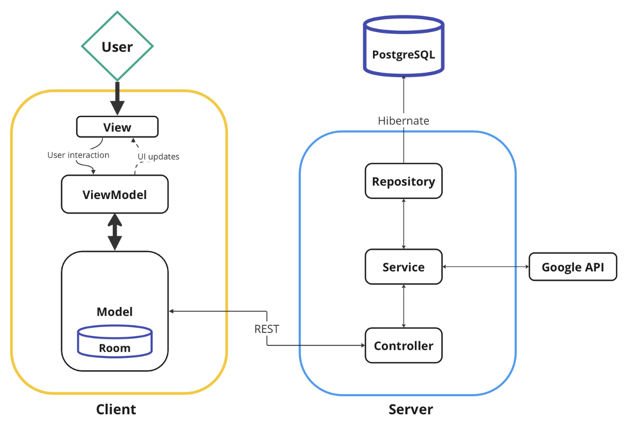

# GoodTrip

### About

Course project about planning trips with social interaction. 
The project consists of server on Kotlin and Java with Spring and Android application.

Android application has a lot of features for trip
planning and opportunities to share your trips with your friends.

The application allows you to mark places you've visited, share photos and notes about your trips, and view routes and posts from friends. It also offers a convenient display of your travels on a map, and includes functionality for searching for interesting places nearby.

### READMEs

You can see detailed descriptions for Android and server parts of application and instructions for deployment in READMEs.
* [README for Android](https://github.com/GoodTripProject/GoodTripAndroid/blob/main/README.md) 
* [README for Server](https://github.com/GoodTripProject/GoodTripServer/blob/main/README.md) 

### Authors

* [Andrei Bolotskii](https://github.com/andrewbolotsky)
* [Daniil Neykov](https://github.com/cowboymalboro1884)
* [Maksim Shtein](https://github.com/MaksimkaSH)

### Application architecture

